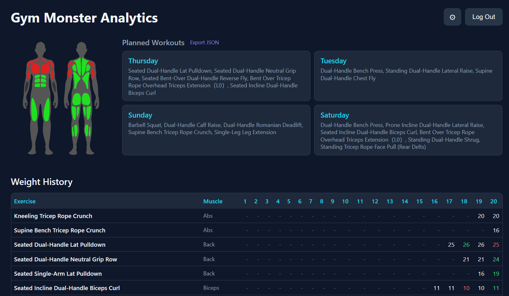
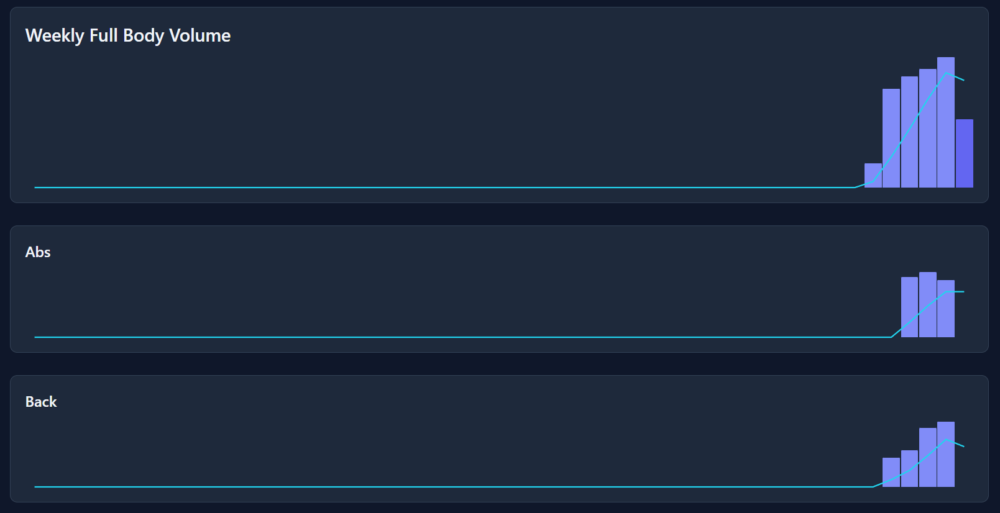

# Gym Monster Analytics

Web app for viewing Speediance Gym Monster workout history.





## Features

- Workout history with calendar view (last 3 months)
- Detailed workout breakdowns with per-set data
- Exercise history tracking with volume trends
- Muscle map visualization showing recovery status
- Planned workout templates with export to JSON
- Per-exercise and per-muscle-group volume charts with rolling averages
- Dual handle / single weight display modes
- Configurable muscle group and handle type mappings

## Tech Stack

- **Backend:** Python Flask
- **Frontend:** Vanilla HTML/CSS/JS (no frameworks)
- **API:** Speediance EU region

## Setup

```bash
pip install -r requirements.txt
python app.py
```

Opens at http://localhost:5000. Log in with your Speediance account credentials.
